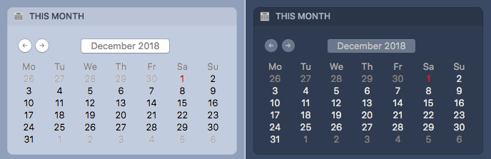

# Calendar

Based on https://github.com/szhu/calendar-in-notification-center and https://github.com/sdarlington/Calendar .

A simple calendar Notification Center widget for macOS. Tested on Mojave 10.14. It uses your locale to determine whether your week starts on a Sunday or Monday.

## User Guide

- Use the arrow buttons to go previous month or next month.
- Swipe up and down to go to the next and previous month.
- Swipe left or press the title to go back to the current month.

## Installation

### Option 1:

Download the zip file from the [Releases](https://github.com/lassana/calendar-in-notification-center/releases) page, extract it and double click the `Calendar.app`.

### Option 2:

Build the app and save it somewhere safe (not in the Application's folder, since you probably don't want to overwrite Apple's Calendar app!). Then you can add the "This Month" widget to your Notification Center.

## License
    Calendar
    Copyright (C) 2015 Wandle Software Limited

    This program is free software; you can redistribute it and/or modify
    it under the terms of the GNU General Public License as published by
    the Free Software Foundation; either version 2 of the License, or
    (at your option) any later version.

    This program is distributed in the hope that it will be useful,
    but WITHOUT ANY WARRANTY; without even the implied warranty of
    MERCHANTABILITY or FITNESS FOR A PARTICULAR PURPOSE.  See the
    GNU General Public License for more details.

    You should have received a copy of the GNU General Public License along
    with this program; if not, write to the Free Software Foundation, Inc.,
    51 Franklin Street, Fifth Floor, Boston, MA 02110-1301 USA.
